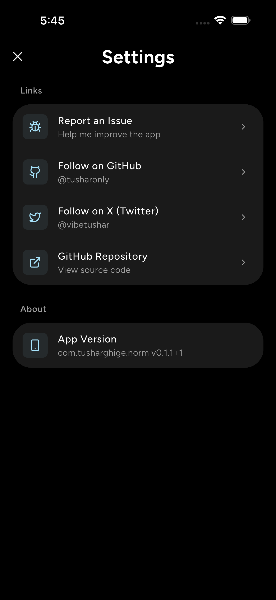

# Norm - Habit Tracker

  
  
  
  

Norm is a minimal habit tracker that focuses on quick daily logging. The home screen highlights a few recent days for fast updates, while the habit details screen provides the full timeline view for deeper tracking. It is completely ad-free and open source. Built using the [Flutter](https://flutter.dev/) framework, a popular and powerful cross-platform development tool.

## How it looks

  <kbd></kbd>
  <kbd></kbd>
  <kbd></kbd>

 

  
See full screenshots

  

    <kbd></kbd>
    <kbd></kbd>
    <kbd></kbd>
  

   

  

    <kbd></kbd>
    <kbd></kbd>
    <kbd></kbd>
  

   

  

    <kbd></kbd>
  

